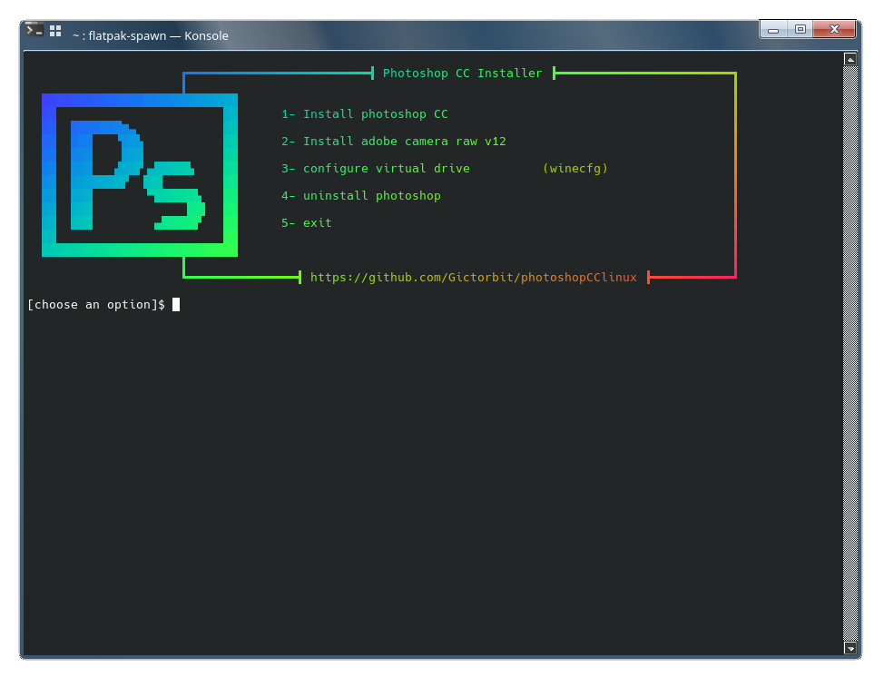

<div align="center" class="tip" markdown="1" style>


    
</div>

# Photoshop CC Installer: Just Works Edition
This bash script installs Photoshop CC 2018 on your Linux machine using wine behind the scenes
and sets up some necessary components up for the best performance AND IT ACTUALLY WORKS!

## :rocket: Features
* Downloads necessary components and installs them (`vcrun`, `atmlib`, `msxml`...)
* Downloads *WORKING* `photoshop.exe` installer
* Creates photoshop command and a desktop entry
* Wine dark mode
* Supports graphic cards like (`intel`, `Nvidia`)
* Saves the downloaded files in your cache directory
* It's free and you will not need any license key
* Works on any Linux distribution

## :warning: Requirements
1. A 64bit Operating System

2. The following packages packages
* `wine`
* `wine64` (non arch users)
* `winetricks`
* `md5sum`


You can install them using your package manager, i.e. in Arch Linux:
```bash
sudo pacman -S wine winetricks
``` 
Or for Ubuntu:
```bash
sudo dpkg --add-architecture i386 && sudo mkdir -p /etc/apt/keyrings && sudo wget -O /etc/apt/keyrings/winehq-archive.key https://dl.winehq.org/wine-builds/winehq.key && sudo wget -NP /etc/apt/sources.list.d/ https://dl.winehq.org/wine-builds/ubuntu/dists/$(lsb_release -sc)/winehq-$(lsb_release -sc).sources && sudo apt update && sudo apt install -y --install-recommends winehq-stable winetricks
```


3. Enough storage in your `/home` partition for the install: `5G`

`1G` will be freed after installation 


## :computer: Installation

The installer scripts use a virtual drive in wine and makes a new `winprefix` for photoshop

1. Clone the repository with this command:
```bash
git clone https://github.com/kc01-8/photoshopCClinux.git
cd photoshopCClinux
```
2. For Arch users only, symlink wine64 to new wine

`sudo ln -sf /usr/bin/wine /usr/bin/wine64`

3. Run `setup.sh` script

```bash
chmod +x setup.sh
./setup.sh
```

4. (optional) Use `-d` to specify the installation path, and `-c` for the cache directory
for example:
```bash
./PhotoshopSetup.sh -d /mnt/myfiles/photoshop
```
or
```bash
./PhotoshopSetup.sh -d /mnt/myfiles/photoshop -c /mnt/cache
```
If no options are given the installer script will use the default path


<div align="center" class="tip" markdown="1" style>


</div>

During installation pay attention to the script messages.


> **NOTE :** Arch users do not need the wine64 package. Do not change OS version in wine from windows 7.

## :wine_glass: wineprefix Configuration
To configure the wineprefix of photoshop you can use `winecfg.sh` script:
```bash
chmod +x winecfg.sh
./winecfg.sh
```
## :hammer: Tools

<details>
<summary>:sparkles: Liquify Tools</summary>
As you know photoshop has many useful tools like `Liquify Tools`.</br>

If you get some errors while working with these tools,
It may because of the graphics card.</br>

Photoshop uses the `GPU` to process these tools so before using these tools make sure that your graphics card `(Nvidia, AMD)` is configured correctly in your Linux machine.
</br>The other solution is you can configure photoshop to use your `CPU` for image processing. to do that, follow the steps below:

* Go to edit tab and open `preferences` or `[ctrl+K]`
* Then go to the `performance` tab
* In the graphics processor settings section, uncheck `Use graphics processor`


</details>

---
<details>
<summary>:camera: Adobe Camera Raw</summary>

`camera raw` install:
```bash
chmod +x cameraRawInstaller.sh
./cameraRawInstaller.sh
```
Restart photoshop and open it from:
`Edit >>Preferences >> Camera Raw`

> **_NOTE1:_** The size of camera raw installation file is about 400M


> **_NOTE2:_** Camera raw performance depends on your graphic card driver and its configuration

</details>

## :hotsprings: Uninstall
To uninstall photoshop you can use the uninstaller script with commands below

```bash
chmod +x uninstaller.sh
./uninstaller.sh
```
---
Forked from the abandoned [Gictorbit/photoshopCClinux](https://github.com/Gictorbit/photoshopCClinux.git)

## :bookmark: License


